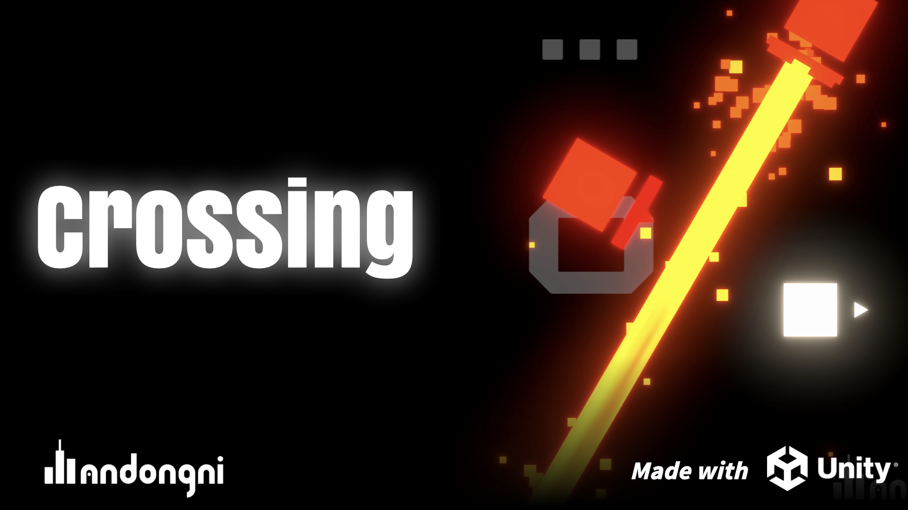

# Crossing

 

## 📄 Game Description
> This project is a small shooting game developed by me using **Unity2022.3.10**. In the game, you control a small cube to shoot enemies. You will encounter basic cubes, dangerous walls, laser cubes, shield cubes, and a boss.
> Your have a  special skill --- **Crossing**, which allows you to cross to the opposite side of the screen by touching the screen's edge.Use this skill along with your shooting abilities to score more points. Have Fun!

 
# 📡 Tech Stack 
- **Unity**: Game development platform.
- **Unity URP**: The rendering pipeline in Unity.
- **[DoTween](https://dotween.demigiant.com/)**: A plugin about animation engine for Unity


# 🎮 How to Play
1. Open the game.
2. You can press the `TEACH` button to enter the tutorial scene or press the `CROSSING` button to enter easy mode.
> The `HARD` button at the top right is for hard mode.

3. Use the following controls:
   - `WASD`: Move
   - `Left Mouse Button`: Shoot
   - Touch the screen edge to **Cross**.
6. Defeat as many enemies as possible to score points.


# Installation

### Download the game 
Go to the **Release** Page download the game.

### Clone Repository
1. Clone the repository:
   ```bash
   git clone https://github.com/yourusername/Unity_Crossing-2DTopDown.git
   ```
2. Open the project in **Unity (version 2022.3.10 or later)**.

